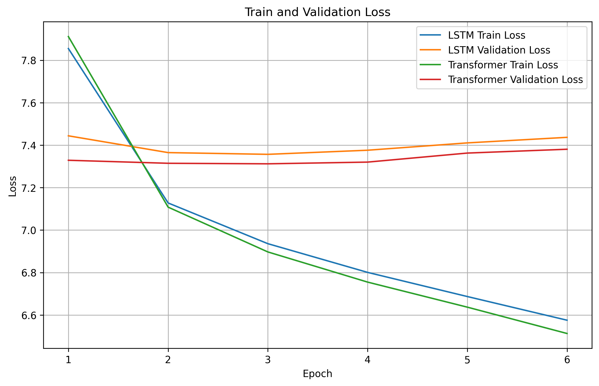
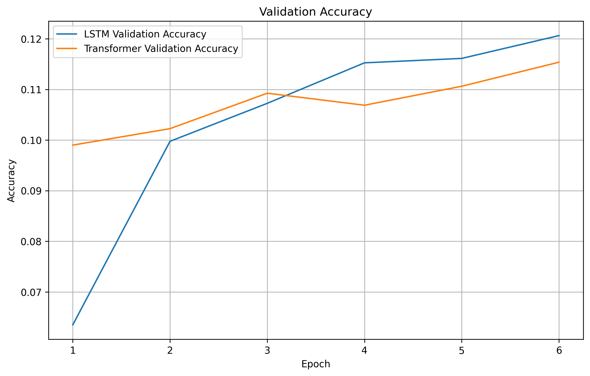
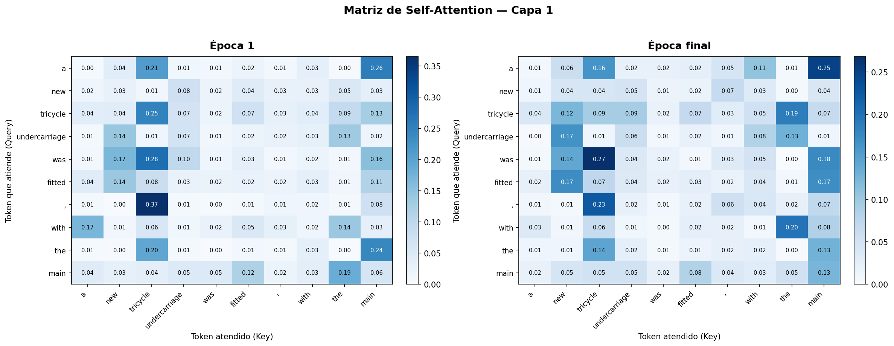
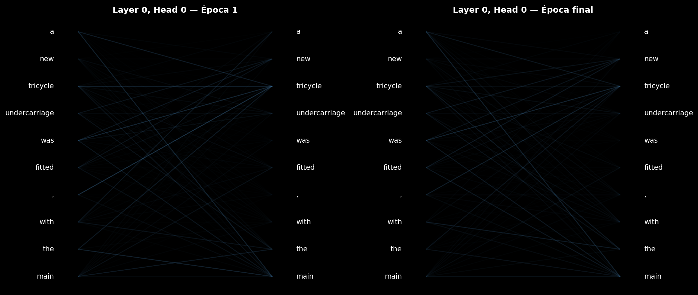

# 0. Contexto y carga de librerías

En este ejercicio práctico nos inspiramos en el paper “Text Classification: Neural Networks vs Machine Learning Models vs Pre-trained Models” (https://arxiv.org/pdf/2412.21022). En realidad, en este ejercicio trabajaremos con text generation, pero el paper nos va a ser útil para entender cómo comparar modelos, tipos de gráficas o ablation studies que se pueden aplicar.  El objetivo del trabajo es explorar y entender de manera práctica cómo distintos tipos de redes neuronales secuenciales pueden abordar la tarea de clasificación de texto.


### Consideraciones sobre complejidad computacional y uso de GPU en la PEC:
**Atención -> Ejecutar correctamente esta PEC lleva tiempo y organización**.

Vamos a trabajar con transformers, arquitecturas grandes, etc. Será necesaria la utilización de GPU para acelerar los cálculos y, además, el tiempo de computación puede ser elevado. La ejecución final de todo el ejercicio puede llevar fácilmente varias horas en GPU. Por ello, aquí tienes algunos consejos fundamentales para facilitar tu trabajo:
* Comienza programando y debugueando tu ejercicio con subconjuntos pequeños que puedas ejecutar en minutos. Incluso en local, en cpu. También puedes considerar ir haciendo la PEC por partes sin necesidad de ejecutar todo. Cuando tu código esté preparado, escala tu ejercicio.
* Si utilizas plataformas como Kaggle y Colab, ten en cuenta sus limitaciones de tiempo y organízate de acuerdo.
* Kaggle es más estable que Colab.
* Si utilizas Colab Pro, ten en cuenta que si lo linqueas con Kaggle, también tendrás más horas de cómputo en Kaggle. https://www.kaggle.com/blog/level-up-your-compute-more-gpu-hours-on-kaggle-wit
* Comienza la PEC pronto, para que te de tiempo a ejecutarla y comentar tus conclusiones antes de entregarla.
* A la hora de elegir las GPUs, ten en cuenta cual es más rápida. e.g. https://www.topcpu.net/es/gpu-c/tesla-p100-pcie-16-gb-vs-tesla-t4
* Por mucho que tengas acceso a 2xGPU, si tu código no está adaptado a multiGPU, simplemente tendrás una GPU sin utilizar.
* Te parece largo? Echa un vistazo a los tiempos de entrenamiento de LLMs (interesante Megatron-Turing): https://en.wikipedia.org/wiki/List_of_large_language_models

```python
# Librerías

import math
import copy
import random
import time

import numpy as np
import pandas as pd
import matplotlib.pyplot as plt

import torch
import torch.nn as nn
import torch.nn.functional as F
from torch.utils.data import Dataset, DataLoader, Subset
from torch.nn.utils.rnn import pad_sequence
from datasets import load_dataset
from collections import Counter
from transformers import Trainer, TrainingArguments, AutoTokenizer, AutoModelForSequenceClassification,  DataCollatorWithPadding

import evaluate
metric = evaluate.load("accuracy")

from tqdm import tqdm
from tabulate import tabulate

DEVICE = torch.device("cuda" if torch.cuda.is_available() else "cpu")
print(DEVICE)
```

# 1. Baseline. RNN vs Transformers
Vamos a comenzar comparando text generation, en particular, vamos a implementar desde cero dos modelos sencillos de text generation. Un modelo LSTM y un modelo basado en transformers y compararlos entre ellos.

<div style="background-color: #EDF7FF; border-color: #7C9DBF; border-left: 5px solid #7C9DBF; padding: 0.5em;">

Antes de entrenar modelos de lenguaje, necesitamos convertir el texto en unidades básicas que podamos utilizar y hay varios pasos para preparar un texto para entrenar un modelo de generación de lenguaje.
1. Tokenización. Estas unidades básicas pueden ser de muy diferentes tipos: palabras, bpe, caracteres, etc. En esta primera parte utilizaremos palabras. El objetivo es separar el texto en unidades básicas (https://www.traceloop.com/blog/a-comprehensive-guide-to-tokenizing-text-for-llms)
2. Codificación de tokens a números.
3. Padding y secuencias fijas. Las secuencias de entrenamiento deben tener la misma longitud. Aquí utilizaremos una longitud de 50. El modelo intentará predecir la última palabra, en base a las anteriores. Si la secuencia es más corta, simplemente rellenala con un padding.

**Ejercicio 1. Preparación de los datos [1 pts.].**

- Cargar el dataset wikitext-2-raw-v1 desde el repositorio de hugginface https://huggingface.co/datasets/Salesforce/wikitext
- Preparación de tus datos de train, validation y text de la siguiente forma:
  * Tokeniza el texto
  * Crea secuencias de hasta 50 palabras más la palabra objetivo (la 51) (con cada texto crea el máximo número de secuencias posibles)
  * Quizás entrenar con todas las secuencias sea demasiado. Elige de forma adecuada un subconjunto de ellas.
- Muestra en una tabla los datos que había al principio, el número de secuencias totales generadas y con las que te has quedado al final. La tabla debe estar bien formateada con lineas
- Imprime en pantalla 10 secuencias de cada uno de tus subconjuntos finales
</div>

## 1.1. Carga de datos

Se ha utilizado el dataset `wikitext-2-raw-v1` disponible en HuggingFace, compuesto por fragmentos de texto extraídos de Wikipedia. Este dataset se encuentra dividido en tres subconjuntos independientes: entrenamiento (*train*), validación (*validation*) y prueba (*test*).

La carga del dataset se realiza mediante la librería `datasets`, que descarga automáticamente los ficheros y los almacena en caché local para reutilizaciones posteriores. Cada elemento del dataset contiene una única columna denominada `text`, que almacena fragmentos de texto sin procesar.

```python
# Carga el dataset
dataset = load_dataset("Salesforce/wikitext", "wikitext-2-raw-v1")

print(dataset)
```

DatasetDict({
    test: Dataset({
        features: ['text'],
        num_rows: 4358
    })
    train: Dataset({
        features: ['text'],
        num_rows: 36718
    })
    validation: Dataset({
        features: ['text'],
        num_rows: 3760
    })
})

## 1.2. Preparación de los conjuntos de datos: *train*, *test*, *validation*

### 1.2.1. Tokenización simple a nivel de palabra

Para transformar el texto en unidades básicas manejables por los modelos, en este paso se implementa una tokenización sencilla a nivel de palabra. Inicialmente, se filtran y eliminan los fragmentos de texto vacíos en los tres subconjuntos (*train*, *validation* y *test*) para limpiar los datos. 

```python
train_texts = [t for t in dataset["train"]["text"] if len(t.strip()) > 0]
valid_texts = [t for t in dataset["validation"]["text"] if len(t.strip()) > 0]
test_texts  = [t for t in dataset["test"]["text"] if len(t.strip()) > 0]
```

Posteriormente, se define una función de tokenización que convierte todo el texto a minúsculas y lo divide basándose en los espacios en blanco.

```python
# Tokenización simple: split por espacios y lowercase
def tokenize_text(text):
    '''
    Tokeniza un texto convirtiéndolo a minúsculas y dividiéndolo por espacios.
    '''
    text = text.lower().strip()
    return text.split()
```

A partir de los textos procesados del conjunto de entrenamiento, se contabilizan las apariciones de cada palabra para construir un vocabulario base. A este diccionario se le incorporan dos *tokens* especiales fundamentales: `<PAD>` (índice 0), que servirá más adelante para rellenar y estandarizar la longitud de las secuencias de entrada, y `<UNK>` (índice 1), utilizado para representar cualquier palabra desconocida que no esté presente en el conjunto de entrenamiento. El proceso concluye asignando un identificador numérico único a cada término, dando como resultado un vocabulario final de 66.651 *tokens*.

```python
# Construir vocabulario
counter = Counter()

for text in train_texts:
    counter.update(tokenize_text(text))

SPECIAL_TOKENS = {
    "<PAD>": 0,
    "<UNK>": 1
}

vocab = dict(SPECIAL_TOKENS)

for word, _ in counter.items():
    vocab[word] = len(vocab)

idx2word = {v: k for k, v in vocab.items()}

print(f"Vocab size: {len(vocab)}")
```
Vocab size: 66651

### 1.2.2. Generación de secuencias

El siguiente paso consiste en transformar las listas de *tokens* en secuencias numéricas estructuradas y de longitud fija. Este proceso se lleva a cabo mediante dos operaciones principales:

En primer lugar, la función de **codificación (`encode()`)** mapea cada palabra a su identificador numérico correspondiente utilizando el vocabulario previamente construido. Si se encuentra alguna palabra que no formaba parte del conjunto de entrenamiento, se gestiona automáticamente asignándole el identificador del *token* desconocido (`<UNK>`).

```python
def encode(tokens):
    '''"
    Convierte una lista de tokens a índices usando el vocabulario.
    '''
    return [vocab.get(tok, vocab["<UNK>"]) for tok in tokens]
```

En segundo lugar, la **construcción de secuencias (`create_sequences()`)** aplica una técnica de ventana deslizante sobre cada texto. De este modo, en cada paso, se toman hasta 50 palabras previas como contexto y se define la palabra inmediatamente posterior como el objetivo a predecir (`target`).

```python
def create_sequences(texts, seq_len=50):
    '''
    Construye secuencias de entrenamiento para un modelo de lenguaje autoregresivo.
    '''
    sequences = []

    # iteramos por cada texto y construimos secuencias de longitud seq_len
    for text in texts:
        tokens = tokenize_text(text)

        # solo consideramos textos con al menos 2 tokens
        if len(tokens) < 2:
            continue

        # convertimos tokens a índices usando el vocabulario
        encoded = encode(tokens)

        # ventanas deslizantes
        for i in range(1, len(encoded)):
            start = max(0, i - seq_len)
            seq = encoded[start:i]
            target = encoded[i]

            # padding izquierda
            seq = [vocab["<PAD>"]] * (seq_len - len(seq)) + seq

            # guardamos la secuencia y su token objetivo
            sequences.append((seq, target))
    
    return sequences
```

Dado que las redes neuronales requieren que todas las entradas tengan la misma dimensión, se aplica una técnica de **padding a la izquierda**. Si el contexto disponible tiene menos de 50 palabras (por ejemplo, al principio de una frase), los huecos vacíos al inicio de la secuencia se rellenan con el identificador del *token* `<PAD>`.

Al aplicar esta transformación, el dataset original se expande de forma masiva, ya que cada texto genera tantas secuencias como palabras contenga (menos la primera). Como resultado, obtenemos 2.028.143 de secuencias estructuradas para la fase de entrenamiento, 211.425 para validación y  238.320 para el testeo final del modelo.

```python
# Construir secuencias de entrenamiento
SEQ_LEN = 50 # longitud máxima de secuencia

# Construimos secuencias para cada split
train_sequences = create_sequences(train_texts, SEQ_LEN)
valid_sequences = create_sequences(valid_texts, SEQ_LEN)
test_sequences  = create_sequences(test_texts, SEQ_LEN)

# Imprimir estadísticas
print(f"Train sequences: {len(train_sequences):,}")
print(f"Validation sequences: {len(valid_sequences):,}")
print(f"Test sequences: {len(test_sequences):,}")
```

Train sequences: 2,028,143
Validation sequences: 211,425
Test sequences: 238,320
### 1.2.3. Sub-muestreo de las secuencias

El volumen de secuencias generado en el paso anterior resulta excesivamente grande para realizar pruebas y entrenar los modelos en un tiempo computacional razonable. Por ello, en este apartado se aplica un proceso de **sub-muestreo (*sub-sampling*)**.

Para acotar el tamaño de los datos y agilizar el entrenamiento, se establecen límites máximos mucho más manejables: 60.000 secuencias para la fase de entrenamiento, y 8.000 tanto para validación como para test.

```python
# Reducimos tamaño para hacer entrenamientos razonables
MAX_TRAIN = 60000
MAX_VALID = 8000
MAX_TEST  = 8000
```

Además, para garantizar que este experimento sea estrictamente reproducible en el futuro (es decir, que siempre se seleccionen exactamente las mismas secuencias en diferentes ejecuciones), se inicializa una semilla aleatoria (*seed*) con el valor 42 (se usó en otra PEC's). 

```python
# fijamos semilla para reproducibilidad
random.seed(42)
```

Finalmente, utilizando una función de selección aleatoria (`random.sample`), se extrae la cantidad especificada de secuencias de los conjuntos masivos originales. 

```python
# muestreamos aleatoriamente los subconjuntos de secuencias para cada split
train_sequences = random.sample(
    train_sequences,
    min(MAX_TRAIN, len(train_sequences))
)

valid_sequences = random.sample(
    valid_sequences,
    min(MAX_VALID, len(valid_sequences))
)

test_sequences = random.sample(
    test_sequences,
    min(MAX_TEST, len(test_sequences))
)
```

## 1.3. Tabla resumen de los datos

En este apartado se genera una tabla resumen utilizando la librería `tabulate`. Como se puede observar en los resultados, se parte de una cantidad moderada de fragmentos de texto originales (23.767 en el caso del conjunto de entrenamiento). Tras aplicar el proceso de ventana deslizante para generar el contexto y la palabra objetivo, esta cifra se multiplica exponencialmente hasta superar los dos millones de secuencias totales generadas.

Finalmente, la columna de *Secuencias finales* refleja la aplicación del sub-muestreo, confirmando que los conjuntos han sido acotados con éxito a los límites manejables definidos en el paso anterior. 

```python
# Imprimir tabla resumen por subconjunto
table = [
    [
        "Train",
        len(train_texts),
        len(create_sequences(train_texts, SEQ_LEN)),
        len(train_sequences)
    ],
    [
        "Validation",
        len(valid_texts),
        len(create_sequences(valid_texts, SEQ_LEN)),
        len(valid_sequences)
    ],
    [
        "Test",
        len(test_texts),
        len(create_sequences(test_texts, SEQ_LEN)),
        len(test_sequences)
    ]
]

print(
    tabulate(
        table,
        headers=[
            "Subconjunto",
            "Textos originales",
            "Secuencias totales generadas",
            "Secuencias finales"
        ],
        tablefmt="grid"
    )
)
```

+---------------+---------------------+--------------------------------+----------------------+
| Subconjunto   |   Textos originales |   Secuencias totales generadas |   Secuencias finales |
+===============+=====================+================================+======================+
| Train         |               23767 |                        2028143 |                60000 |
+---------------+---------------------+--------------------------------+----------------------+
| Validation    |                2461 |                         211425 |                 8000 |
+---------------+---------------------+--------------------------------+----------------------+
| Test          |                2891 |                         238320 |                 8000 |
+---------------+---------------------+--------------------------------+----------------------+

## 1.4. Visualización de ejemplos por subonjunto

En este último paso se procede a la inspección visual de las secuencias generadas. 

En primer lugar, se implementa una función de **decodificación (`decode_sequence()`)** que realiza el proceso inverso. Es decir, convierte los identificadores numéricos de las secuencias de vuelta a su formato textual original, omitiendo de forma intencionada los *tokens* de relleno (`<PAD>`) para facilitar la lectura.

```python
def decode_sequence(seq):
    '''
    Decodifica una secuencia de índices a palabras, ignorando los tokens de padding.
    '''
    return [idx2word[idx] for idx in seq if idx != vocab["<PAD>"]]
```
En segundo lugar, la función de **impresión (`print_examples()`)** muestra los diez primeros ejemplos mediante una función de cada uno de los subconjuntos (entrenamiento, validación y prueba). En cada bloque se aprecia:

* **INPUT:** Representa el texto de entrada (compuesto por hasta 50 palabras).
* **TARGET:** Es la palabra inmediatamente posterior.

```python
def print_examples(data, name, n=10):
    '''
    Imprime ejemplos de secuencias de entrada y su token objetivo.
    '''
    print("\n" + "="*80)
    print(name.upper())
    print("="*80)

    for i in range(n):

        seq, target = data[i]

        words = decode_sequence(seq)
        target_word = idx2word[target]

        print(f"\nEjemplo {i+1}")
        print("INPUT :", " ".join(words))
        print("TARGET:", target_word)
```

Mediante la visualización de estos ejemplos prácticos, se observa cómo los signos de puntuación se tratan como *tokens* independientes y, de manera muy destacada, se comprueba el funcionamiento del *token* `<UNK>`. Como es evidente en varios ejemplos de los conjuntos de validación y test (e.g., `<UNK> de san juan de <UNK>`), cualquier término, nombre propio o símbolo que no formaba parte del vocabulario inicial de 66.651 palabras ha sido correctamente detectado y sustituido por el identificador de palabra desconocida.

```python
# Imprimir ejemplos de secuencias
print_examples(train_sequences, "train")
print_examples(valid_sequences, "validation")
print_examples(test_sequences, "test")
```

================================================================================
TRAIN
================================================================================

Ejemplo 1
INPUT : 38 enters auburn , it passes by auburn high school before heading north through densely populated blocks filled with homes . the divided highway ends abruptly at swift street , where ny 38 turns west to follow the two @-@ lane undivided swift street west for seven blocks to ny
TARGET: 34

Ejemplo 2
INPUT : by the end of the 19th century , the city of galveston had a population of 37 @,@ 000 . its position on the natural harbor of galveston bay along the gulf of mexico made it the center of trade in texas . it was one of
TARGET: the

Ejemplo 3
INPUT : 1 , 1849 — atherton was chairman of the senate finance committee . mckay introduced a version into the house on february 20 ; debate began the same day . the dollar was attacked by congressmen from the whig party , then in the minority , on the grounds that
TARGET: it

Ejemplo 4
INPUT : , derby . on 5 september , he scored his first competitive goal for england in the 2 – 0 win against albania at st james ' park , newcastle . this was during qualifying for the 2002 fifa world cup . england qualified for the world cup , and
TARGET: after

Ejemplo 5
INPUT : in the upcoming weeks of holiday sales where it peaked in the year 's last weeks with 486 @,@ 000 and 760 @,@ 000 units sold at the pinnacle . the album moved 760 @,@ 000 copies during the christmas week of 1995 , the album 's highest sales week
TARGET: .

Ejemplo 6
INPUT : to promote the film , eon productions produced a one @-@ hour colour television programme entitled welcome to japan , mr. bond first aired on 2 june 1967 in the
TARGET: united

Ejemplo 7
INPUT : in august , 2011 , beyoncé performed " crazy in love " during her revue show 4 intimate nights with beyoncé . she performed a slowed @-@ down , jazzier version of the song and danced with
TARGET: a

Ejemplo 8
INPUT : protagonists of the water margin . he is also given the nickname " iron arm " ( 铁臂膀 ) , which carried over into the title of his fictional biography iron arm , golden sabre . while the tale fails to explain the reason for the moniker , it does
TARGET: mention

Ejemplo 9
INPUT : = = production =
TARGET: =

Ejemplo 10
INPUT : toniná in 668 . his rule is marked by warfare and the frequent depiction of bound captives on his monuments . ruler 2 established the use of in @-@ the @-@ round sculptural style that came to typify the stelae of toniná . a monument dated to 682 depicts three
TARGET: naked

================================================================================
VALIDATION
================================================================================

Ejemplo 1
INPUT : feature . they made it a joyous occasion for themselves as well as their guests . they were hardly an overly wealthy family , and their table was never notable for an <UNK> of the good things of life , but whenever they gave a dinner they cast all thoughts
TARGET: of

Ejemplo 2
INPUT : small <UNK> and four larger ' <UNK> ' . <UNK> <UNK> ( old norse : ' harbour bay ' ) in the south is the most sheltered anchorage and the surrounding cliffs contain a natural rock arch . <UNK> <UNK> to the east ( old norse : ' house bay
TARGET: '

Ejemplo 3
INPUT : amtrak 's crescent line connects meridian with the cities of new york , new york ; philadelphia , pennsylvania ; baltimore , maryland ; washington , d.c.
TARGET: ;

Ejemplo 4
INPUT : the canadian online explorer rated the show a 7 out of 10 , which was lower than the 8 out of 10 given to the 2007 edition by jason <UNK> . after the event , an accident occurred which resulted in the death of one man and the injury of
TARGET: another

Ejemplo 5
INPUT : scientologists at her request and that of scientology 's office of special affairs , and that she was in personal financial trouble and about to go on trial for tax <UNK> at the time she applied for asylum . on a 2000 visit to clearwater , florida , <UNK> <UNK>
TARGET: of

Ejemplo 6
INPUT : = =
TARGET: lyrics

Ejemplo 7
INPUT : " training day " received mixed reviews from television critics , with many commenting
TARGET: on

Ejemplo 8
INPUT : with britain accepting 200 men from victoria , 260 from new south wales and the south australian ship hmcs protector , under the command of captain william <UNK> . most of these forces were made up of naval brigade <UNK> , who had been trained in both ship handling and
TARGET: soldiering

Ejemplo 9
INPUT : according to guitarist kerry king : " yeah , ' slayer are nazis , fascists , communists ' — all that fun shit . and of course we got the most flak for it in germany .
TARGET: i

Ejemplo 10
INPUT : the <UNK> was informed in october 1985 by federal law enforcement officials that leslie l. <UNK> , an investigative journalist who had written a 20 @-@ part series on the <UNK> movement
TARGET: in

================================================================================
TEST
================================================================================

Ejemplo 1
INPUT : , in effect , attacked straight east across the river and was trying to seize the two avenues of advance into <UNK> above and below lake u @-@ p 'o . on august 31 , 1950 , lake u @-@ p 'o was a large body of water although in
TARGET: most

Ejemplo 2
INPUT : central australian artists frequently paint particular " <UNK> " , or stories , for which they have responsibility or rights . these stories are used to pass " important knowledge , cultural
TARGET: values

Ejemplo 3
INPUT : how to curse was performed at bush theatre in the london borough of hammersmith and fulham . <UNK> starred in two films in 2008 , daylight robbery by filmmaker paris <UNK> , and donkey punch directed by olly blackburn . in may 2008 , <UNK> made a guest appearance on
TARGET: a

Ejemplo 4
INPUT : a number of design faults of the tetrarch were revealed through its operational use . its size limited the possible crew to three , a driver in the hull and
TARGET: a

Ejemplo 5
INPUT : squadron suffered heavy casualties during the invasion ; only one valentine and three <UNK> out of twelve tanks were functional by 7 may , and the squadron had suffered seven killed and six wounded . it remained in madagascar until early 1943 , when it was shipped to india and
TARGET: took

Ejemplo 6
INPUT : the second battle of naktong bulge was an engagement between united nations ( un ) and north korean ( <UNK> ) forces early in the korean war from september 1 to september 15 , 1950 , along the naktong river
TARGET: in

Ejemplo 7
INPUT : order to clear land for his planned palatial complex , the <UNK> <UNK> . in 68 , the rebellion of <UNK> in gaul and later the acclamation of <UNK> in <UNK> drove nero from the throne . facing a false report of being denounced as a public enemy who was
TARGET: to

Ejemplo 8
INPUT : two modern statues which commemorate <UNK> can be found in towns associated with him . there is an equestrian statue in gloucester , england , a town which was founded in his honour . it
TARGET: is

Ejemplo 9
INPUT : some of the country 's oldest schools are founded in <UNK> , these are the university of santo tomas ( 1611 ) , <UNK> de san juan de <UNK> ( 1620 )
TARGET: ,

Ejemplo 10
INPUT : , unhappy with the politics of washington and suffering from poor health . although he was no longer active in politics , he continued to express opinions on the subjects of the day , opposing the 1820 missouri compromise and <UNK> the " great moderation & <UNK> " of federalist
TARGET: governor

<div style="background-color: #fcf2f2; border-color: #dfb5b4; border-left: 5px solid #dfb5b4; padding: 0.5em;">
<p><strong>Solución:</strong> La carga y el preprocesamiento se han ido explicando en cada apartado.</p>
</div>

---
---

<div style="background-color: #EDF7FF; border-color: #7C9DBF; border-left: 5px solid #7C9DBF; padding: 0.5em;">

**Ejercicio 2. Entrenamiento LSTM vs Transformer [2pts.].**

- En esta parte monta dos modelos sencillos. Uno basado en LSTM y otro en Transformer con dos cabezas de atención. Algunos requisitos son:
  * El total de parámetros entrenables de cada uno de ellos debe ser entre 5 y 6 millones de parámetros.
  * La idea es que ambos modelos sean comparables, así que se lo más consistente posible entre ambas arquitecturas. Por ejemplo: uno no puede tener 15 capas y el otro 1 capa.
  * Resto de parámetros es libre. Pero debes intentar evitar overfitting introduciendo regularizaciones, considerando lr, número de épocas, etc.

Se pide:
- Construir ambas arquitecturas y entrenar los modelos. Durante el entrenamiento, en cada época, genera una frase de 10 palabras que comienza con "Artificial intelligence is". El objetivo es que observes como va mejorando la capacidad de generación del modelo (0.5p)
- Mostrar curvas de train loss, validation loss, accuracy validation comparando ambos modelos. Las gráficas deben ser legibles, informativas y claras. En caso contrario se considerarán incorrectas. (0.5p)
- Elegir de ambas arquitecturas el modelo con menor loss en validation y mostrar en una tabla formateada con valores de accuracy sobre test y sobre validation del mejor modelo. (0.5p)
- Explicar en dos líneas tus principales conclusiones al comparar ambas arquitecturas en este problema. (0.5p)

Consideraciones:
- Probablemente tengas que ejecutar el entrenamiento varias veces para afinar los parámetros, escalar los datos o el número de épocas.
- Antes de realizar este ejercicio, es recomendable leer el enunciado de los siguientes ejercicios. El motivo es que deberás conservar algunos checkpoints de este ejercicio para ser utilizados después.
</div>

## 1.5. Preparación de DataLoaders y Arquitecturas

### 1.5.1. Selección de hiperparámetros

Se ajustaron los hiperparámetros de ambas arquitecturas para mantener un número de parámetros entrenables comparable y dentro del rango solicitado en el enunciado (5–6 millones de parámetros).

Dado que el vocabulario obtenido tras la tokenización contiene 66.651 tokens, las capas de embeddings y proyección de salida dominan el tamaño total del modelo. Por este motivo se redujeron las dimensiones internas de embedding (`EMBED_DIM`) y representación oculta (`HIDDEN_DIM`) hasta obtener arquitecturas equilibradas y computacionalmente manejables.

Además, teniendo en cuenta que el ejercicio 3 requiere acceder a los pesos de atención del modelo Transformer, se diseñó la arquitectura desde el inicio con soporte para su extracción, evitando así tener que reentrenar el modelo posteriormente.mensiones internas de embedding (`EMBED_DIM`) y representación oculta (`HIDDEN_DIM`) hasta obtener arquitecturas equilibradas y computacionalmente manejables.

```python
# SELECCIÓN DE HIPERPARÁMETROS

# Longitud máxima de cada secuencia de entrada
SEQ_LEN = 50

# Número de muestras procesadas por batch
BATCH_SIZE = 64

# Dimensión de los embeddings de palabras
EMBED_DIM = 40

# Tamaño del estado oculto de la LSTM
HIDDEN_DIM = 48

# Número de capas LSTM / Transformer
NUM_LAYERS = 2

# Probabilidad de desactivación en dropout
DROPOUT = 0.3

# Número de cabezas de atención del Transformer
NHEAD = 2

# Tasa de aprendizaje del optimizador
LEARNING_RATE = 1e-3

# Número máximo de épocas de entrenamiento
EPOCHS = 15

# Número de épocas sin mejora antes de parar
PATIENCE = 3
```

## 1.5.2. Adaptación de los datos a PyTorch

Se construyeron `DataLoaders` independientes para train, validation y test con el objetivo de alimentar los modelos en batches. En entrenamiento se activó `shuffle=True` para mejorar la generalización del modelo, mientras que en validación y test se mantuvo el orden original.

```python
# Adaptación de los datos a PyTorch

class LanguageModelDataset(Dataset):
    '''
    Dataset personalizado para modelado de lenguaje.

    Convierte cada secuencia y su palabra objetivo
    en tensores de PyTorch preparados para entrenamiento.
    '''
    def __init__(self, sequences):
        self.sequences = sequences

    def __len__(self):
        return len(self.sequences)

    def __getitem__(self, idx):

        seq, target = self.sequences[idx]

        return (
            torch.tensor(seq, dtype=torch.long),
            torch.tensor(target, dtype=torch.long)
        )

# Creamos datasets para cada conjunto de datos
train_ds = LanguageModelDataset(train_sequences)
valid_ds = LanguageModelDataset(valid_sequences)
test_ds  = LanguageModelDataset(test_sequences)

# Creamos dataloaders para cada conjunto de datos, 
# con shuffle solo en el conjunto de entrenamiento
train_loader = DataLoader(train_ds, batch_size=BATCH_SIZE, shuffle=True)
valid_loader = DataLoader(valid_ds, batch_size=BATCH_SIZE, shuffle=False)
test_loader  = DataLoader(test_ds, batch_size=BATCH_SIZE, shuffle=False)
```

## 1.5.3. Diseño e implementacion de modelos sencillos: LSTM y Transformer

En este apartado se implementan dos arquitecturas secuenciales para generación de texto: un modelo basado en LSTM y otro basado en Transformer. Ambos modelos se han diseñado manteniendo una complejidad y número de parámetros similares, permitiendo así realizar una comparación más consistente entre ambas aproximaciones.

### A. LSTM - `LSTMLanguageModel`

La arquitectura LSTM procesa las secuencias de forma recurrente, manteniendo información contextual mediante estados ocultos. Se utilizaron dos capas LSTM y dropout para reducir overfitting y mantener una complejidad comparable con el Transformer.

```python
# LSTM

class LSTMLanguageModel(nn.Module):
    '''
    Modelo de lenguaje basado en LSTM.

    Procesa secuencias de texto mediante capas recurrentes
    y predice la siguiente palabra de la secuencia.
    '''
    def __init__(
        self,
        vocab_size,
        embed_dim,
        hidden_dim,
        num_layers,
        dropout
    ):
        super().__init__()

        # la capa de embedding convierte índices de palabras a vectores densos
        self.embedding = nn.Embedding(
            vocab_size,
            embed_dim,
            padding_idx=0
        )

        # la capa LSTM procesa las secuencias de embeddings palabra a palabra, 
        # manteniendo un estado oculto que captura información del contexto previo
        self.lstm = nn.LSTM(
            input_size=embed_dim,
            hidden_size=hidden_dim,
            num_layers=num_layers,
            batch_first=True,
            dropout=dropout
        )

        # el dropout se aplica a la salida del LSTM para evitar sobreajuste
        self.dropout = nn.Dropout(dropout)

        # la capa fully connected toma la salida del LSTM y produce logits para cada palabra en el vocabulario
        # Transforma el espacio de características del LSTM al espacio de vocabulario para hacer la predicción
        self.fc = nn.Linear(hidden_dim, vocab_size)

    def forward(self, x):

        # convertimos los índices de palabras a embeddings densos
        x = self.embedding(x)

        # el LSTM devuelve la salida para cada token de la secuencia, 
        # pero solo nos interesa la salida del último token
        out, _ = self.lstm(x)

        # solo nos interesa la salida del último token de la secuencia, que es donde el modelo hace su predicción
        out = out[:, -1, :]

        # aplicamos dropout a la salida del LSTM antes de pasarla a la capa fully connected
        out = self.dropout(out)

        # la capa fully connected produce los logits para cada palabra en el vocabulario, 
        # que luego se usarán para calcular la pérdida y hacer predicciones
        logits = self.fc(out)

        return logits
```

### B. Transformer - `TransformerLanguageModel`

El Transformer procesa toda la secuencia simultáneamente mediante mecanismos de atención. Se utilizaron dos cabezas de atención (`nhead=2`) tal y como solicita el enunciado, incorporando codificación posicional para conservar información sobre el orden de las palabras.

Dado que el ejercicio 3 requiere acceder a los pesos de atención del modelo ya entrenado, la arquitectura incorpora desde el principio capas personalizadas (`TransformerEncoderLayerWithAttn`) que exponen los pesos de atención mediante `need_weights=True`, confirmado como el parámetro correcto en PyTorch (ver el foro de la PEC-M4). 

> Referencia: *Attention Is All You Need* (Vaswani et al., 2017)

```python
# TRANSFORMER

class PositionalEncoding(nn.Module):
    '''
    Implementa codificación posicional sinusoidal para Transformers.

    Permite al modelo incorporar información sobre
    la posición de cada token dentro de la secuencia.
    '''
    def __init__(self, d_model, max_len=5000):
        super().__init__()

        # creamos una matriz de codificación posicional de tamaño (max_len, d_model)
        pe = torch.zeros(max_len, d_model)

        # cada posición se codifica usando funciones sinusoidales de diferentes frecuencias
        position = torch.arange(0, max_len).unsqueeze(1)

        # las dimensiones pares se codifican con funciones seno y las impares con funciones coseno
        div_term = torch.exp(
            torch.arange(0, d_model, 2) *
            (-math.log(10000.0) / d_model)
        )

        # aplicamos las funciones seno y coseno a las posiciones para crear la codificación posicional
        pe[:, 0::2] = torch.sin(position * div_term)
        pe[:, 1::2] = torch.cos(position * div_term)

        # añadimos una dimensión extra para que se pueda sumar a los embeddings de las palabras
        pe = pe.unsqueeze(0)

        # registramos la matriz de codificación posicional como un buffer del módulo,
        self.register_buffer("pe", pe)

    def forward(self, x):

        # sumamos la codificación posicional a los embeddings de las palabras para que el modelo pueda distinguir
        # la posición de cada token
        return x + self.pe[:, :x.size(1)] # type: ignore


class TransformerEncoderLayerWithAttn(nn.Module):
    '''
    Capa Transformer personalizada que devuelve los pesos de atención
    mediante need_weights=True en nn.MultiheadAttention.
    '''
    def __init__(self, d_model, nhead, dropout=0.1):
        super().__init__()

        # mecanismo de self-attention con need_weights habilitado
        self.self_attn = nn.MultiheadAttention(
            d_model, nhead,
            dropout=dropout,
            batch_first=True
        )

        # bloque feedforward con una capa oculta de tamaño 4*d_model, activación ReLU y dropout
        self.linear1 = nn.Linear(d_model, d_model * 4)
        # la segunda capa del bloque feedforward reduce la dimensionalidad de vuelta a d_model
        self.linear2 = nn.Linear(d_model * 4, d_model)
        # las capas de normalización se aplican después de cada bloque con conexiones residuales
        self.norm1   = nn.LayerNorm(d_model)
        # la segunda capa de normalización se aplica después del bloque feedforward
        self.norm2   = nn.LayerNorm(d_model)
        # el dropout se aplica después de cada bloque para evitar sobreajuste
        self.dropout = nn.Dropout(dropout)

    def forward(self, x):

        # self-attention
        attn_out, attn_weights = self.self_attn(
            x, x, x,
            #  recupera los pesos de atención
            need_weights=True,
            # promedia las cabezas de atencion
            average_attn_weights=True
        )

        # conexión residual + normalización
        x = self.norm1(x + self.dropout(attn_out))

        # bloque feedforward
        ff = self.linear2(self.dropout(F.relu(self.linear1(x))))
        # conexión residual + normalización
        x  = self.norm2(x + self.dropout(ff))

        return x, attn_weights


class TransformerLanguageModel(nn.Module):
    '''
    Modelo de lenguaje basado en Transformer Encoder.

    Utiliza mecanismos de atención para procesar toda la secuencia
    simultáneamente. Soporta extracción de pesos de atención
    mediante el parámetro return_attentions=True.
    '''
    def __init__(self, vocab_size, embed_dim, nhead, num_layers, dropout):
        super().__init__()

        # la capa de embedding convierte índices de palabras a vectores densos
        self.embedding    = nn.Embedding(vocab_size, embed_dim)
        # la codificación posicional se suma a los embeddings para que el modelo pueda distinguir la posición de cada token
        self.pos_encoding = PositionalEncoding(embed_dim)

        # apilamos las capas personalizadas que exponen los pesos de atención
        self.layers = nn.ModuleList([
            TransformerEncoderLayerWithAttn(embed_dim, nhead, dropout)
            for _ in range(num_layers)
        ])

        # el dropout se aplica a la salida del Transformer antes de pasarla a la capa fully connected
        self.dropout = nn.Dropout(dropout)
        # la capa fully connected toma la salida del Transformer y produce logits para cada palabra en el vocabulario
        self.fc      = nn.Linear(embed_dim, vocab_size)

    def forward(self, x, return_attentions=False):

        # convertimos los índices de palabras a embeddings densos
        x        = self.embedding(x)
        # sumamos la codificación posicional a los embeddings para que el modelo pueda distinguir la posición de cada token
        x        = self.pos_encoding(x)
        all_attn = []

        # iteramos por cada capa del Transformer, pasando la salida de una como entrada a la siguiente
        for layer in self.layers:
            x, attn = layer(x)
            all_attn.append(attn)

        # solo nos interesa la salida del último token de la secuencia, que es donde el modelo hace su predicción
        out    = x[:, -1, :]
        # aplicamos dropout a la salida del Transformer antes de pasarla a la capa fully connected
        out    = self.dropout(out)
        # la capa fully connected produce los logits para cada palabra en el vocabulario, que luego se usarán para calcular la pérdida y hacer predicciones
        logits = self.fc(out)

        if return_attentions:
            return logits, all_attn

        return logits
```

## 1.5.4. Inicialización de los modelos

Observando el output de la función de conteo (`count_parameters()`), se confirma que ambos modelos cumplen la restricción indicada en el enunciado, manteniendo entre 5 y 6 millones de parámetros entrenables. Además, las arquitecturas son comparables en profundidad y complejidad, permitiendo realizar una comparación más justa entre LSTM y Transformer.

```python
# Inicializamos ambos modelos con los mismos hiperparámetros para una comparación justa

VOCAB_SIZE = len(vocab)

lstm_model = LSTMLanguageModel(
    vocab_size=VOCAB_SIZE,
    embed_dim=EMBED_DIM,
    hidden_dim=HIDDEN_DIM,
    num_layers=NUM_LAYERS,
    dropout=DROPOUT
).to(DEVICE)

transformer_model = TransformerLanguageModel(
    vocab_size=VOCAB_SIZE,
    embed_dim=EMBED_DIM,
    nhead=NHEAD,
    num_layers=NUM_LAYERS,
    dropout=DROPOUT
).to(DEVICE)

def count_parameters(model):
    return sum(p.numel() for p in model.parameters() if p.requires_grad)

print("LSTM params:", count_parameters(lstm_model))
print("Transformer params:", count_parameters(transformer_model))
```
LSTM params: 5968035
Transformer params: 5744027

## 1.5.5. Generación de texto

Mediante la función de generacion de texto (`generate_text()`), se observa cualitativamente cómo evoluciona el modelo durante el entrenamiento. A medida que las épocas avanzan, se espera que las frases generadas pasen de repeticiones simples a secuencias más coherentes y estructuradas.

```python
# Generación de texto

def generate_text(model, seed_text, max_words=10):
    '''
    Genera texto a partir de un texto semilla utilizando el modelo entrenado.
    '''
    # el modelo se pone en modo evaluación para desactivar dropout y otros comportamientos específicos de entrenamiento
    model.eval()

    # tokenizamos el texto semilla y lo convertimos a índices usando el vocabulario
    words = seed_text.lower().split()

    # iteramos para generar max_words palabras adicionales
    for _ in range(max_words):
        encoded = [
            vocab.get(w, vocab["<UNK>"])
            for w in words
        ]

        # solo consideramos las últimas SEQ_LEN palabras para generar la siguiente palabra,
        encoded = encoded[-SEQ_LEN:]

        # padding izquierda para asegurar que la secuencia tenga longitud SEQ_LEN, rellenando con el token <PAD> si es necesario
        encoded = [vocab["<PAD>"]] * (SEQ_LEN - len(encoded)) + encoded

        # convertimos la secuencia de índices a un tensor y la movemos al dispositivo (CPU o GPU)
        x = torch.tensor(encoded).unsqueeze(0).to(DEVICE)


        # hacemos una pasada hacia adelante por el modelo para obtener los logits de la siguiente palabra
        with torch.no_grad():
            logits = model(x)

        # obtenemos el índice de la palabra con mayor logit, que es la predicción del modelo para la siguiente palabra
        pred = torch.argmax(logits, dim=-1).item()

        # convertimos el índice de la palabra predicha de vuelta a una palabra usando el vocabulario inverso
        next_word = idx2word.get(pred, "<UNK>") # type: ignore

        # añadimos la palabra predicha a la lista de palabras para generar la siguiente palabra en la próxima iteración
        words.append(next_word)

    return " ".join(words)
```

## 1.5.6. Evaluación de los modelos

Durante la evaluación mediante la función (`evaluate_model()`) se calcularon tanto la pérdida (`loss`) como la precisión (`accuracy`) sobre validación y test. Estas métricas permiten comparar el rendimiento de ambas arquitecturas y detectar posibles problemas de sobreajuste.

```python
# Evaluacion del modelo en el conjunto de validación o test

def evaluate_model(model, loader, criterion):
    '''
    Evalúa el modelo en un conjunto de datos dado por el loader, calculando la pérdida promedio y la precisión.
    '''

    # el modelo se pone en modo evaluación para desactivar dropout y otros comportamientos específicos de entrenamiento
    model.eval()
    total_loss = 0
    correct = 0
    total = 0

    # iteramos por el loader sin calcular gradientes para evaluar el modelo en el conjunto de validación o test
    with torch.no_grad():

        for x, y in loader:

            x = x.to(DEVICE)
            y = y.to(DEVICE)

            logits = model(x)

            loss = criterion(logits, y)

            total_loss += loss.item()

            preds = logits.argmax(dim=1)

            correct += (preds == y).sum().item()
            total += y.size(0)

    return total_loss / len(loader), correct / total
```

## 1.5.7. Entrenamiento de los modelos

Durante el entrenamiento mediante la función (`train_model()`) se almacenaron métricas de `loss` y `accuracy` para posteriormente comparar ambas arquitecturas mediante gráficas. Se implementó `early stopping` para detener automáticamente el entrenamiento cuando la pérdida de validación deja de mejorar, reduciendo así el riesgo de overfitting.

Adicionalmente, dado que el ejercicio 3 requiere comparar los pesos de atención en dos momentos distintos del entrenamiento, la función guarda un checkpoint al finalizar la primera época. El checkpoint del estado final corresponde al mejor modelo recuperado por el mecanismo de early stopping.

```python
# Entrenamiento del modelo con early stopping

def train_model(model, train_loader, valid_loader, epochs):
    '''
    Entrena el modelo y evalúa su rendimiento en validación tras cada época.

    Guarda un checkpoint al finalizar la época 1 para su uso posterior
    en la visualización de pesos de atención (ejercicio 3).

    Devuelve el modelo con los mejores pesos, el historial de métricas
    y el checkpoint de la primera época.
    '''
    criterion  = nn.CrossEntropyLoss()
    optimizer  = torch.optim.Adam(model.parameters(), lr=LEARNING_RATE)

    history    = {"train_loss": [], "valid_loss": [], "valid_acc": []}

    best_model              = None
    best_loss               = float("inf")
    epochs_without_improvement = 0
    checkpoint_epoch1       = None   # checkpoint guardado al final de la época 1

    for epoch in range(epochs):
        model.train()
        running_loss = 0

        for x, y in tqdm(train_loader):
            x, y = x.to(DEVICE), y.to(DEVICE)
            optimizer.zero_grad()
            logits = model(x)
            loss   = criterion(logits, y)
            loss.backward()
            torch.nn.utils.clip_grad_norm_(model.parameters(), 1.0)
            optimizer.step()
            running_loss += loss.item()

        train_loss            = running_loss / len(train_loader)
        valid_loss, valid_acc = evaluate_model(model, valid_loader, criterion)

        history["train_loss"].append(train_loss)
        history["valid_loss"].append(valid_loss)
        history["valid_acc"].append(valid_acc)

        print(f"\nEpoch {epoch+1}")
        print(f"Train loss: {train_loss:.4f}")
        print(f"Valid loss: {valid_loss:.4f}")
        print(f"Valid acc : {valid_acc:.4f}")

        generated = generate_text(model, "Artificial intelligence is", max_words=10)
        print(f"\nGenerated text:\n{generated}")

        # guardamos el estado del modelo al finalizar la primera época
        if epoch == 0:
            checkpoint_epoch1 = copy.deepcopy(model.state_dict())
            print("\nCheckpoint época 1 guardado")

        # early stopping
        if valid_loss < best_loss:
            best_loss  = valid_loss
            best_model = copy.deepcopy(model.state_dict())
            epochs_without_improvement = 0
            print("\nValidation loss improved")
        else:
            epochs_without_improvement += 1
            print(f"\nNo improvement for {epochs_without_improvement} epoch(s)")

            if epochs_without_improvement >= PATIENCE:
                print("\nEarly stopping activated")
                break

    model.load_state_dict(best_model)
    return model, history, checkpoint_epoch1
```

## 1.5.7. Resultados del entrenamiento

Los resultados muestran que ambos modelos aprenden progresivamente durante las primeras épocas, reduciendo el `train loss` y mejorando ligeramente la `validation accuracy`. Sin embargo, la `validation loss` deja de mejorar rápidamente, por lo que el mecanismo de `early stopping` detiene el entrenamiento para evitar sobreajuste.

En las frases generadas se aprecia que, al inicio, ambos modelos repiten palabras muy frecuentes como *“the”*, algo habitual en modelos pequeños entrenados sobre un vocabulario muy grande. A medida que avanzan las épocas, comienzan a aparecer estructuras algo más coherentes, aunque todavía simples.

También se observa que el Transformer requiere bastante más tiempo por época que el LSTM, algo esperable debido al coste computacional del mecanismo de atención. Finalmente, las métricas de validación y test son muy similares entre ambos modelos, indicando que las dos arquitecturas presentan un rendimiento comparable en este problema.

```python
# Iniciar Entrenamiento

lstm_model, lstm_history, _ = train_model(
    lstm_model, train_loader, valid_loader, epochs=EPOCHS
)

transformer_model, transformer_history, transformer_ckpt_epoch1 = train_model(
    transformer_model, train_loader, valid_loader, epochs=EPOCHS
)
```

100%|██████████| 938/938 [01:46<00:00,  8.84it/s]

Epoch 1
Train loss: 7.8532
Valid loss: 7.4244
Valid acc : 0.0635

Generated text:
artificial intelligence is the the the the the the the the the the

Validation loss improved
100%|██████████| 938/938 [01:43<00:00,  9.09it/s]

Epoch 2
Train loss: 7.1418
Valid loss: 7.3765
Valid acc : 0.0960

Generated text:
artificial intelligence is the the the , , the the the the ,

Validation loss improved
100%|██████████| 938/938 [01:45<00:00,  8.89it/s]

Epoch 3
Train loss: 6.9428
Valid loss: 7.3549
Valid acc : 0.1118

Generated text:
artificial intelligence is the the the the the the the the the the

Validation loss improved
100%|██████████| 938/938 [01:41<00:00,  9.26it/s]

Epoch 4
Train loss: 6.7999
Valid loss: 7.3762
Valid acc : 0.1136

Generated text:
artificial intelligence is the the the the the the the the the the

No improvement for 1 epoch(s)
100%|██████████| 938/938 [01:49<00:00,  8.59it/s]

Epoch 5
Train loss: 6.6809
Valid loss: 7.3798
Valid acc : 0.1168

Generated text:
artificial intelligence is the the first of the first of the the first

No improvement for 2 epoch(s)
100%|██████████| 938/938 [01:44<00:00,  9.01it/s]

Epoch 6
Train loss: 6.5719
Valid loss: 7.4448
Valid acc : 0.1179

Generated text:
artificial intelligence is the first of the first of the first of the

No improvement for 3 epoch(s)

Early stopping activated
100%|██████████| 938/938 [08:02<00:00,  1.94it/s]

Epoch 1
Train loss: 7.8977
Valid loss: 7.2945
Valid acc : 0.1022

Generated text:
artificial intelligence is the the the the the the the the the the

Validation loss improved
100%|██████████| 938/938 [08:02<00:00,  1.94it/s]

Epoch 2
Train loss: 7.0966
Valid loss: 7.2491
Valid acc : 0.1092

Generated text:
artificial intelligence is the first , the first , the first , the

Validation loss improved
100%|██████████| 938/938 [08:03<00:00,  1.94it/s]

Epoch 3
Train loss: 6.8787
Valid loss: 7.2640
Valid acc : 0.1121

Generated text:
artificial intelligence is the first , and the first , and the first

No improvement for 1 epoch(s)
100%|██████████| 938/938 [07:58<00:00,  1.96it/s]

Epoch 4
Train loss: 6.7407
Valid loss: 7.2996
Valid acc : 0.1116

Generated text:
artificial intelligence is the first , the first , the first , the

No improvement for 2 epoch(s)
100%|██████████| 938/938 [07:58<00:00,  1.96it/s]

Epoch 5
Train loss: 6.6356
Valid loss: 7.3446
Valid acc : 0.1144

Generated text:
artificial intelligence is the first " , and the first , and the

No improvement for 3 epoch(s)

Early stopping activated

## 1.5.8. Persistencia de checkpoints del Transformer

Para evitar repetir el costoso entrenamiento del Transformer en cada sesión, los checkpoints de la época 1 y del modelo final se guardaron en disco tras la primera ejecución. Las celdas se mantienen comentadas para no sobreescribir accidentalmente los modelos ya entrenados.

# transformer_model, transformer_history, transformer_ckpt_epoch1 = train_model(
#    transformer_model, train_loader, valid_loader, epochs=EPOCHS
# )

# Guardamos ambos checkpoints en disco
# torch.save(transformer_ckpt_epoch1,        r"../models/transformer_ckpt_epoch1.pt")
# torch.save(transformer_model.state_dict(), r"../models/transformer_ckpt_final.pt")

# Cargar si es necesario
# ckpt_epoch1 = torch.load(r"../models/transformer_ckpt_epoch1.pt", map_location=DEVICE)
# ckpt_final  = torch.load(r"../models/transformer_ckpt_final.pt",  map_location=DEVICE)

# tokens_e1,    attn_e1    = get_attention_weights(ckpt_epoch1, SAMPLE_SENTENCE)
# tokens_final, attn_final = get_attention_weights(ckpt_final,  SAMPLE_SENTENCE)


## 1.5.9. Visualización de la evolucion por modelo

En la gráfica de pérdida se observa que ambos modelos reducen su `train loss` de forma continua, mientras que la `validation loss` se estabiliza desde las primeras épocas, evidenciando un sobreajuste temprano que el `early stopping` corta correctamente. El Transformer mantiene una `validation loss` inferior al LSTM durante todo el entrenamiento (~7.29 vs ~7.42), lo que justifica su selección como mejor modelo.

```python
# ============================================================
# PLOTS
# ============================================================
lstm_epochs = range(1, len(lstm_history["train_loss"]) + 1)
transformer_epochs = range(1,len(transformer_history["train_loss"]) + 1)

# ============================================================
# LOSS
# ============================================================
plt.figure(figsize=(10, 6))
plt.plot(lstm_epochs, lstm_history["train_loss"], label="LSTM Train Loss")
plt.plot(lstm_epochs, lstm_history["valid_loss"], label="LSTM Validation Loss")
plt.plot(transformer_epochs, transformer_history["train_loss"],label="Transformer Train Loss")
plt.plot(transformer_epochs, transformer_history["valid_loss"], label="Transformer Validation Loss")
plt.xlabel("Epoch")
plt.ylabel("Loss")
plt.title("Train and Validation Loss")
plt.legend()
plt.grid()
# guardar figura
plt.savefig(r"../figures/train_validation_loss.png", dpi=300, bbox_inches="tight")
plt.show()
```



En cuanto a la `validation accuracy`, el Transformer parte con ventaja en la primera época (~0.102 vs ~0.064), lo que refleja su capacidad para capturar relaciones globales en la secuencia desde el inicio. Ambos modelos convergen a partir de la época 3, estabilizándose en torno al 11–12%. A partir de ese punto, el LSTM supera ligeramente al Transformer en accuracy, aunque la diferencia es marginal (~0.003). Los valores de accuracy son bajos en términos absolutos, pero esperables dado el tamaño del vocabulario (~66K tokens): predecir la siguiente palabra exacta en un corpus tan rico como WikiText-2 es una tarea muy exigente para modelos de ~5–6M de parámetros. 

```python
# ============================================================
# VALIDATION ACCURACY
# ============================================================
plt.figure(figsize=(10, 6))
plt.plot(lstm_epochs, lstm_history["valid_acc"], label="LSTM Validation Accuracy")
plt.plot(transformer_epochs, transformer_history["valid_acc"], label="Transformer Validation Accuracy")

plt.xlabel("Epoch")
plt.ylabel("Accuracy")
plt.title("Validation Accuracy")
plt.legend()
plt.grid()
# guardar figura
plt.savefig(r"../figures/validation_accuracy.png", dpi=300, bbox_inches="tight")
plt.show()
```



## 1.5.10. Evaluación y comparación del rendimiento de los modelos

La tabla muestra los resultados de ambos modelos sobre los conjuntos de validación y test. 

El Transformer obtiene una menor pérdida de validación, siendo seleccionado como el mejor modelo, aunque ambas arquitecturas presentan valores de `accuracy` muy similares (cercanos al 11 %).

Los resultados son coherentes para con la dificultad de predecir la siguiente palabra exacta sobre un vocabulario de más de 66.000 tokens con modelos de entre 5 y 6 millones de parámetros. Es de destacar que el LSTM supera ligeramente al Transformer en `Validation accuracy` con un coste computacional por época significativamente menor, lo que puede ser relevante en escenarios con recursos limitados.

```python
criterion = nn.CrossEntropyLoss()

lstm_val_loss, lstm_val_acc = evaluate_model(
    lstm_model,
    valid_loader,
    criterion
)

lstm_test_loss, lstm_test_acc = evaluate_model(
    lstm_model,
    test_loader,
    criterion
)

tr_val_loss, tr_val_acc = evaluate_model(
    transformer_model,
    valid_loader,
    criterion
)

tr_test_loss, tr_test_acc = evaluate_model(
    transformer_model,
    test_loader,
    criterion
)

results = [
    ["LSTM", lstm_val_loss, lstm_val_acc, lstm_test_acc],
    ["Transformer", tr_val_loss, tr_val_acc, tr_test_acc]
]

print(
    tabulate(
        results,
        headers=["Modelo", "Validation Loss", "Validation Accuracy", "Test Accuracy"],
        tablefmt="grid",
        floatfmt=".4f"
    )
)

best_model_name = (
    "LSTM"
    if lstm_val_loss < tr_val_loss
    else "Transformer"
)

print(f"El mejor modelo de acuerdo a la pérdida de validación es: {best_model_name}")
```

+-------------+-------------------+-----------------------+-----------------+
| Modelo      |   Validation Loss |   Validation Accuracy |   Test Accuracy |
+=============+===================+=======================+=================+
| LSTM        |            7.3568 |                0.1072 |          0.1047 |
+-------------+-------------------+-----------------------+-----------------+
| Transformer |            7.3122 |                0.1092 |          0.1052 |
+-------------+-------------------+-----------------------+-----------------+
El mejor modelo de acuerdo a la pérdida de validación es: Transformer

<div style="background-color: #fcf2f2; border-color: #dfb5b4; border-left: 5px solid #dfb5b4; padding: 0.5em;">
<p><strong>Pregunta:</strong> Explicar en dos líneas tus principales conclusiones al comparar ambas arquitecturas en este problema.</p>

<p><strong>Solución:</strong> El Transformer logra ligeramente mejor pérdida de validación y accuracy sobre test. Esto sugiere una mejor capacidad para capturar relaciones contextuales dentro de la secuencia gracias al mecanismo de self-attention.</p>
</div>

---
---

# 2. Visualización transformers
En esta parte vamos a visualizar los pesos de atención de las capas transformer para entender como funciona el contexto y la atención.


<div style="background-color: #EDF7FF; border-color: #7C9DBF; border-left: 5px solid #7C9DBF; padding: 0.5em;">


**Ejercicio 3. Visualización sobre la cabeza de atención [1 pts.].**
En este ejercicio, el objetivo es representar los pesos de self-attention del modelo anterior y de otro modelo preentrenado. Las visualizaciones que se piden son (1) matriz de self attention y (2) token alignment. Estas dos visualizaciónes se pueden ver en la figura 1 izquierda arriba y figura 1 izquierda abajo de [ Interpretability analysis in transformers based on attention visualization](https://www.researchgate.net/publication/382296866_Interpretability_analysis_in_transformers_based_on_attention_visualization). Para ello, elige una frase de train y:
  1. Representa la matriz de atención para el modelo entrenado en el apartado anterior en su estado en la época 1 y en su estado en la época final. [0.4p]
  2. Repite lo mismo, pero ahora representando el token alignment. [0.4p]
  3. Escribe en dos líneas lo que observas. [0.2p]


Notas:
* Para entender mejor este tipo de visualizaciones se recomida ver el siguiente vídeo: [
Atención en los Transformers explicado visualmente](https://www.youtube.com/watch?v=eMlx5fFNoYc)
* Para realizar las representaciones visuales se puede utilizar cualquier tipo de libreria.
* Utiliza return_attentions=True en tu modelo para recuperar los pesos de la matriz de atención.
</div>

## 2.1. Extracción de pesos de atención

Dado que el `TransformerLanguageModel` del ejercicio 2 ya incorpora soporte para `return_attentions=True` mediante `need_weights=True` en `nn.MultiheadAttention` (confirmado su uso como el parámetro correcto por el equipo docente en el foro de la PEC-M4), no es necesario redefinir ni reentrenar ningún modelo. Los checkpoints de la época 1 (`transformer_ckpt_epoch1`) y del estado final (`transformer_model.state_dict()`) quedaron guardados durante el entrenamiento del ejercicio 2.

Se selecciona una frase real del conjunto de entrenamiento con al menos 8 palabras, fijando la semilla para garantizar reproducibilidad. La función `get_attention_weights()` carga el checkpoint indicado en el modelo, realiza un forward pass con `return_attentions=True` y devuelve los tokens y los pesos de atención de la primera capa del encoder, recortados a la longitud real de la frase.

```pyton
# Selección reproducible de una frase real del conjunto de entrenamiento
random.seed(42)
sample_text = random.choice([t for t in train_texts if len(t.split()) >= 8])
SAMPLE_SENTENCE = " ".join(sample_text.lower().split()[:10])
print(f"Frase seleccionada: {SAMPLE_SENTENCE}")
```
Frase seleccionada: a new tricycle undercarriage was fitted , with the main

```python
def get_attention_weights(state_dict, sentence):
    '''
    Carga un checkpoint en el TransformerLanguageModel del ejercicio 2
    y extrae los pesos de atención de la primera capa del encoder
    para la frase indicada.
    '''

    # inicializamos un nuevo modelo Transformer con los mismos hiperparámetros que el modelo entrenado
    model = TransformerLanguageModel(
        vocab_size=VOCAB_SIZE,
        embed_dim=EMBED_DIM,
        nhead=NHEAD,
        num_layers=NUM_LAYERS,
        dropout=DROPOUT
    ).to(DEVICE)

    # cargamos el estado del modelo desde el checkpoint proporcionado
    model.load_state_dict(state_dict)
    model.eval()

    # tokenizamos la frase de entrada, convertimos las palabras a índices usando el vocabulario,
    # ajustamos la secuencia a la longitud SEQ_LEN
    words   = sentence.lower().split()
    encoded = [vocab.get(w, vocab["<UNK>"]) for w in words]
    encoded = encoded[-SEQ_LEN:]
    encoded = [vocab["<PAD>"]] * (SEQ_LEN - len(encoded)) + encoded

    # convertimos la secuencia de índices a un tensor y la movemos al dispositivo (CPU o GPU)
    x = torch.tensor(encoded).unsqueeze(0).to(DEVICE)

    # hacemos una pasada hacia adelante por el modelo con return_attentions=True para obtener 
    # los pesos de atención de la primera capa
    with torch.no_grad():
        _, all_attn = model(x, return_attentions=True)

    # primera capa, recortada a la longitud real de la frase
    attn = all_attn[0].squeeze(0).cpu().numpy()
    n    = len(words)
    attn = attn[-n:, -n:]

    return words, attn


# Extraemos pesos para época 1 y época final
tokens_e1,    attn_e1    = get_attention_weights(transformer_ckpt_epoch1,          SAMPLE_SENTENCE)
tokens_final, attn_final = get_attention_weights(transformer_model.state_dict(),   SAMPLE_SENTENCE)
```

## 2.2. Matriz de self-attention

La matriz de *self-attention* muestra cómo cada token distribuye su atención sobre el resto de la secuencia. En la época 1 la atención aparece todavía dispersa, aunque ya destacan relaciones como la elevada atención del token ‘,’ hacia *tricycle* (0.37). En el modelo final la atención se vuelve más selectiva y estructurada, concentrándose principalmente en tokens relevantes como *tricycle*, mientras palabras menos informativas como *a* o *the* reciben menor atención.

```python
# Visualización de la matriz de self-attention para época 1 y época final

fig, axes = plt.subplots(1, 2, figsize=(16, 6))

for ax, attn, tokens, title in zip(
    axes,
    [attn_e1,   attn_final],
    [tokens_e1, tokens_final],
    ["Época 1", "Época final"]
):
    im = ax.imshow(attn, cmap="Blues", vmin=0, vmax=attn.max(), aspect="auto")

    ax.set_xticks(range(len(tokens)))
    ax.set_yticks(range(len(tokens)))
    ax.set_xticklabels(tokens, rotation=45, ha="right", fontsize=9)
    ax.set_yticklabels(tokens, fontsize=9)
    ax.set_title(title, fontsize=13, fontweight="bold", pad=10)
    ax.set_xlabel("Token atendido (Key)",      fontsize=10)
    ax.set_ylabel("Token que atiende (Query)", fontsize=10)

    # anotamos el valor numérico en cada celda
    for i in range(len(tokens)):
        for j in range(len(tokens)):
            ax.text(
                j, i, f"{attn[i, j]:.2f}",
                ha="center", va="center",
                fontsize=7,
                color="white" if attn[i, j] > attn.max() * 0.6 else "black"
            )

    plt.colorbar(im, ax=ax, fraction=0.046, pad=0.04)

fig.suptitle("Matriz de Self-Attention — Capa 1", fontsize=14, fontweight="bold", y=1.02)
plt.tight_layout()

plt.savefig(r"../figures/attention_matrix.png", dpi=150, bbox_inches="tight")
plt.show()
```



## 2.3. Token alignment

El token *alignment* visualiza cómo cada token atiende al resto de la secuencia mediante conexiones entre pares (query -> key) cuya intensidad refleja el peso de atención. En la época 1 las conexiones son más dispersas y homogéneas, aunque destacan ligeramente *tricycle* y *main*, mientras que en el modelo final la atención se concentra claramente en términos clave como *tricycle*, *undercarriage* y *main*, reduciendo el peso de conexiones secundarias y mostrando un aprendizaje más enfocado y consistente.

```python
# Visualización del token alignment para época 1 y época final

def plot_bertviz_style(ax, attn, tokens, title):
    '''
    Dibuja el token alignment al estilo BertViz: fondo negro, tokens a ambos
    lados y líneas con opacidad proporcional al peso de atención.
    '''
    ax.set_facecolor("black")
    n = len(tokens)

    # posiciones verticales de los tokens (de arriba a abajo)
    y_positions = list(range(n))

    for i, tok in enumerate(tokens):
        # columna izquierda (query)
        ax.text(
            0.0, i, tok,
            ha="right", va="center",
            color="white", fontsize=10,
            transform=ax.get_yaxis_transform()
        )
        # columna derecha (key)
        ax.text(
            1.0, i, tok,
            ha="left", va="center",
            color="white", fontsize=10,
            transform=ax.get_yaxis_transform()
        )

    # dibujamos una línea por cada par (query i → key j)
    for i in range(n):
        for j in range(n):
            weight = attn[i, j]
            if weight > 0.01:   # omitimos conexiones casi nulas
                ax.plot(
                    [0.1, 0.9], [i, j],
                    color="steelblue",
                    alpha=float(weight),
                    linewidth=1.2,
                    transform=ax.get_yaxis_transform()
                )

    ax.set_xlim(-0.5, 1.5)
    ax.set_ylim(-0.5, n - 0.5)
    ax.invert_yaxis()
    ax.axis("off")
    ax.set_title(title, color="white", fontsize=12,
                 fontweight="bold", pad=8)


fig, axes = plt.subplots(
    1, 2,
    figsize=(14, 6),
    facecolor="black"
)

plot_bertviz_style(axes[0], attn_e1,    tokens_e1,    "Layer 0, Head 0 — Época 1")
plot_bertviz_style(axes[1], attn_final, tokens_final, "Layer 0, Head 0 — Época final")

plt.tight_layout()

plt.savefig(r"../figures/token_alignment_Bertviz_style.png", dpi=150, bbox_inches="tight",  facecolor="black")

plt.show()
```



<div style="background-color: #fcf2f2; border-color: #dfb5b4; border-left: 5px solid #dfb5b4; padding: 0.5em;">
<p><strong>Solución:</strong> El ejercicio se ha ido explicando e interpretando en cada apartado</p>
</div>

---
---

# 3. Modelos transformers fundacionales
A diferencia de las redes recurrentes, los modelos basados en Transformers tienen la capacidad de escalar en tamaño gracias a sus mecanismos de atención. Por eso, en la práctica, se pueden entrenar modelos muy profundos con billones de parámetros. Debido a esto, difícilmente un individuo o incluso la gran mayoría de empresas y grupos de investigación tienen las capacidades de entrar en estos modelos desde cero. Vamos a plantear cómo se realizaría en la práctica esto.

El objetivo de esta sección va ser tener el mejor modelo de análisis de sentimiento para IMBD basado en arquitecturas preentrenadas tipo Bert. Aquí, supon que tienes que **poner este modelo en producción**, para ello tienes que conseguir un **modelo con una accuracy suficientemente buena, pero también que sea rápido y eficiente**. Para ello exploraremos 4 enfoques distintos y complementarios en los ejercicios 4, 5, 6 y 7.

<div style="background-color: #EDF7FF; border-color: #7C9DBF; border-left: 5px solid #7C9DBF; padding: 0.5em;">

**Ejercicio 4. Finetuning downstream de un modelo pequeño [2 pts.].**
Este ejercicio debes tomar el modelo preentrenado [gaunernst/bert-mini-uncased](https://huggingface.co/gaunernst/bert-mini-uncased) de hugginface y entrenarlo para clasificar la base de datos [imbd](https://huggingface.co/datasets/stanfordnlp/imdb). Tanto el modelo como la base de datos los puedes descargar de forma automática de huggingface. Se pide:

1. Muestra en pantalla la estructura del modelo y el número de parámetros.
2. Modifica el modelo downstream para convertirlo en un modelo de clasificación. Toma las decisiones y suposiciones que consideres de forma debidamente justificada. Preprocesa la base de datos para poder entrenarla con el modelo.
3. Entrena el modelo de forma adecuada y completa.
4. Muestra las curvas de entrenamiento. Las gráficas deben ser claras e informativas.
5. Finalmente, muestra los resultados sobre el conjunto de test de tu mejor modelo.
6. Calcula cuanto tiempo cuesta hacer una inferencia sobre todo el conjunto de test.
7. Construye una tabla (imprimiendola adecuadamente con tabular) en la que se muestre el nombre del modelo, el número de parámetros, la accuracy sobre test y el tiempo de inferencia sobre todo el conjunto de test.

</div>

## 3.1. Finetuning downstream de un modelo pequeño

### 3.1.1 Carga del dataset `stanfordnlp/imdb`

Se ha utilizado el dataset `stanfordnlp/imdb` disponible en HuggingFace, compuesto por reseñas de películas etiquetadas según su sentimiento como positivas o negativas. Este dataset se encuentra dividido en tres subconjuntos independientes: entrenamiento (*train*), prueba (*test*) y un subconjunto adicional no supervisado (*unsupervised*).

La carga del dataset se realiza mediante la librería `datasets`, que descarga automáticamente los ficheros y los almacena en caché local para reutilizaciones posteriores. Cada elemento del dataset contiene dos columnas: `text`, que almacena la reseña en texto plano, y `label`, que indica la clase asociada a cada ejemplo.

```python
# Carga del dataset
dataset = load_dataset("stanfordnlp/imdb")

print(dataset)
```

DatasetDict({
    train: Dataset({
        features: ['text', 'label'],
        num_rows: 25000
    })
    test: Dataset({
        features: ['text', 'label'],
        num_rows: 25000
    })
    unsupervised: Dataset({
        features: ['text', 'label'],
        num_rows: 50000
    })
})

### 3.1.2. Carga del modelo `gaunernst/bert-mini-uncased`

Para este ejercicio, el modelo `gaunernst/bert-mini-uncased` es seleccionado desde HuggingFace. Por ser una versión reducida de BERT, una mayor eficiencia en el uso de memoria y una velocidad superior en el entrenamiento son permitidas, lográndose un equilibrio óptimo entre el coste computacional y la precisión.

En primer lugar, el tokenizer es cargado para la transformación del texto en tokens numéricos. Posteriormente, el modelo preentrenado es implementado mediante `AutoModelForSequenceClassification`. Para adaptar la estructura a la clasificación de sentimiento, el parámetro `num_labels=2` es especificado, de modo que la capa de salida original es reemplazada por una cabeza de clasificación binaria.

```python
# Carga del model preentrenado
MODEL_NAME = "gaunernst/bert-mini-uncased"

# Tokenizador asociado al modelo
tokenizer = AutoTokenizer.from_pretrained(
    MODEL_NAME
)

# Modelo adaptado automáticamente para clasificación binaria
model = AutoModelForSequenceClassification.from_pretrained(
    MODEL_NAME,
    num_labels=2
).to(DEVICE)
```
Some weights of BertForSequenceClassification were not initialized from the model checkpoint at gaunernst/bert-mini-uncased and are newly initialized: ['classifier.bias', 'classifier.weight']
You should probably TRAIN this model on a down-stream task to be able to use it for predictions and inference.

### 3.1.3. Revisión de la arquitectura y número de parámetros

Antes del entrenamiento, la arquitectura y el número de parámetros son analizados para estimar el coste computacional y el tamaño del modelo. En **bert-mini-uncased**, la estructura estándar de BERT es mantenida, pero bajo una configuración reducida.

Dicho diseño es compuesto por:

* **Embeddings** de dimensión 256.
* **4 capas Transformer** con mecanismos de *self-attention*.
* Una **capa final** adaptada para clasificación binaria.

Mediante la reducción de capas y dimensiones, el número total de parámetros es disminuido considerablemente, por lo cual el proceso de entrenamiento es acelerado. Finalmente, la arquitectura completa y el conteo de parámetros entrenables son presentados a continuación.

```python
# Estructura del modelo
print(model)

# Numero de parametros entrenables
print("Parámetros entrenables:", count_parameters(model))
```

BertForSequenceClassification(
  (bert): BertModel(
    (embeddings): BertEmbeddings(
      (word_embeddings): Embedding(30522, 256, padding_idx=0)
      (position_embeddings): Embedding(512, 256)
      (token_type_embeddings): Embedding(2, 256)
      (LayerNorm): LayerNorm((256,), eps=1e-12, elementwise_affine=True)
      (dropout): Dropout(p=0.1, inplace=False)
    )
    (encoder): BertEncoder(
      (layer): ModuleList(
        (0-3): 4 x BertLayer(
          (attention): BertAttention(
            (self): BertSdpaSelfAttention(
              (query): Linear(in_features=256, out_features=256, bias=True)
              (key): Linear(in_features=256, out_features=256, bias=True)
              (value): Linear(in_features=256, out_features=256, bias=True)
              (dropout): Dropout(p=0.1, inplace=False)
            )
            (output): BertSelfOutput(
              (dense): Linear(in_features=256, out_features=256, bias=True)
              (LayerNorm): LayerNorm((256,), eps=1e-12, elementwise_affine=True)
              (dropout): Dropout(p=0.1, inplace=False)
            )
          )
          (intermediate): BertIntermediate(
            (dense): Linear(in_features=256, out_features=1024, bias=True)
            (intermediate_act_fn): GELUActivation()
          )
          (output): BertOutput(
            (dense): Linear(in_features=1024, out_features=256, bias=True)
            (LayerNorm): LayerNorm((256,), eps=1e-12, elementwise_affine=True)
            (dropout): Dropout(p=0.1, inplace=False)
          )
        )
      )
    )
    (pooler): BertPooler(
      (dense): Linear(in_features=256, out_features=256, bias=True)
      (activation): Tanh()
    )
  )
  (dropout): Dropout(p=0.1, inplace=False)
  (classifier): Linear(in_features=256, out_features=2, bias=True)
)
Parámetros entrenables: 11171074

### 3.1.4. Proceso de Tokenización

Debido a que el texto sin procesar no puede ser interpretado directamente por los modelos basados en BERT, cada reseña es transformada en una secuencia de tokens numéricos mediante el tokenizer de `bert-mini-uncased`.

Durante esta fase, las siguientes operaciones son aplicadas:

* Truncado y Longitud Máxima: Las secuencias son limitadas automáticamente a un máximo de 256 tokens. Con esto, el contexto semántico es conservado mientras que el uso de memoria es reducido y la velocidad de ejecución es optimizada.
* Padding Dinámico: En lugar de una longitud fija prematura, el relleno es aplicado dinámicamente durante la creación de batches para maximizar la eficiencia computacional.

Finalmente, esta transformación es ejecutada sobre todos los subconjuntos del dataset a través de la función `map()`.

```python
# Tokenización del dataset
MAX_LENGTH = 256

# Función de tokenización para mapear sobre el dataset
def tokenize_function(batch):
    '''
    Tokeniza un batch de textos utilizando el tokenizador preentrenado.
     - Aplica truncation para recortar textos largos a MAX_LENGTH tokens.
    '''
    return tokenizer(
        batch["text"],
        truncation=True,
        max_length=MAX_LENGTH
    )

# Aplicar tokenización a todo el dataset
tokenized_dataset = dataset.map(
    tokenize_function,
    batched=True
)
```

Map: 100%
 25000/25000 [00:14<00:00, 2026.99 examples/s]
Map: 100%
 25000/25000 [00:12<00:00, 2015.88 examples/s]
Map: 100%
 50000/50000 [00:26<00:00, 1967.45 examples/s]

### 3.1.5. Preparación de batches para entrenamiento

Una vez finalizada la tokenización, el dataset se adapta al formato de **PyTorch** para permitir un entrenamiento eficiente. Debido a las longitudes variables de las secuencias en los modelos Transformer, el **padding dinámico** es ejecutado durante la creación de batches. Mediante este proceso, los tokens de relleno son añadidos únicamente hasta alcanzar la longitud máxima de cada batch, con lo que el consumo de memoria es reducido y la velocidad del modelo es optimizada.

Para la implementación de esta técnica, se emplea `DataCollatorWithPadding`, mediante el cual el `padding` es aplicado automáticamente en coordinación con el `tokenizer`. Finalmente, los subconjuntos de datos son convertidos y estructurados a través de un `DataLoader`, de modo que la iteración sobre los datos en mini-batches es facilitada durante el entrenamiento.

```python
# Padding dinámico automático
data_collator = DataCollatorWithPadding(tokenizer=tokenizer)

# Eliminar columnas innecesarias
tokenized_dataset = tokenized_dataset.remove_columns(["text"])

# Renombrar label -> labels (formato esperado por HuggingFace)
tokenized_dataset = tokenized_dataset.rename_column("label", "labels")

# Dividir train en 90% train / 10% validación ANTES de set_format
# para usar el método nativo de HuggingFace
train_val = tokenized_dataset["train"].train_test_split(
    test_size=0.1,
    seed=42          # reproducibilidad
)

# Conversión a tensores PyTorch
train_val.set_format("torch")
tokenized_dataset["test"].set_format("torch")

# DataLoaders
BATCH_SIZE = 64

train_dataloader = DataLoader(train_val["train"], batch_size=BATCH_SIZE, shuffle=True,  collate_fn=data_collator)
val_dataloader   = DataLoader(train_val["test"],  batch_size=BATCH_SIZE, shuffle=False, collate_fn=data_collator)
test_dataloader  = DataLoader(tokenized_dataset["test"], batch_size=BATCH_SIZE, shuffle=False, collate_fn=data_collator)
```

### 3.1.6. Diseño de la estrategia de entrenamiento

En esta fase, los componentes necesarios para el `fine-tuning` del modelo son definidos. Para la optimización de los parámetros, el algoritmo **AdamW** es utilizado debido a su estabilidad en arquitecturas Transformer. Una tasa de aprendizaje reducida ($2 \times 10^{-5}$) es seleccionada para que los pesos previamente aprendidos sean ajustados de forma suave.

Asimismo, la estabilidad y la convergencia son favorecidas mediante un `scheduler lineal`, por el cual la tasa de aprendizaje es reducida progresivamente. Finalmente, el número de épocas es establecido y el total de pasos de entrenamiento es calculado a partir del tamaño del `dataset` y del `batch size` seleccionado.

> Parametros escogidos segun recomendacion del paper Devlin et al., 2019.
```python
# Hiperparámetros
EPOCHS        = 5
LEARNING_RATE = 2e-5
PATIENCE      = 2
```

```python
# Optimizador
optimizer = AdamW(model.parameters(), lr=LEARNING_RATE)

# Número total de pasos de entrenamiento
num_training_steps = EPOCHS * len(train_dataloader)

# Scheduler lineal
lr_scheduler = get_scheduler(
    name="linear",
    optimizer=optimizer,
    num_warmup_steps=0,
    num_training_steps=num_training_steps
)
```

### 3.1.7. Entrenamiento y evaluación del modelo

Durante esta fase, los parámetros del modelo son ajustados mediante las reseñas del conjunto de entrenamiento. En cada *batch*, una **propagación hacia adelante** es realizada, la pérdida de clasificación es calculada y, tras la **propagación de gradientes hacia atrás**, los pesos son actualizados por el optimizador.

Al término de cada época, la capacidad de generalización es monitorizada mediante una **evaluación sobre el conjunto de test**, donde tanto la pérdida como la *accuracy* son obtenidas. Finalmente, las métricas de entrenamiento y evaluación son almacenadas para que las curvas de aprendizaje del modelo sean representadas posteriormente.

```python
# Historial de métricas
train_losses = []
val_losses   = []
test_losses  = []

train_accuracies = []
val_accuracies   = []
test_accuracies  = []

# Early stopping
best_val_loss              = float("inf")
epochs_without_improvement = 0

# BUCLE DE ENTRENAMIENTO
for epoch in range(EPOCHS):

    print(f"\nÉPOCA {epoch + 1}/{EPOCHS}")

    # ── TRAIN ──────────────────────────────────────────────
    model.train()

    total_train_loss  = 0
    train_predictions = []
    train_labels_list = []

    progress_bar = tqdm(train_dataloader)

    for batch in progress_bar:

        batch   = {k: v.to(DEVICE) for k, v in batch.items()}
        outputs = model(**batch)
        loss    = outputs.loss
        logits  = outputs.logits

        optimizer.zero_grad()
        loss.backward()
        optimizer.step()
        lr_scheduler.step()

        total_train_loss += loss.item()

        predictions = torch.argmax(logits, dim=-1)
        train_predictions.extend(predictions.cpu().numpy())
        train_labels_list.extend(batch["labels"].cpu().numpy())

        progress_bar.set_postfix({"loss": loss.item()})

    avg_train_loss = total_train_loss / len(train_dataloader)
    train_accuracy = accuracy_score(train_labels_list, train_predictions)

    train_losses.append(avg_train_loss)
    train_accuracies.append(train_accuracy)

    model.eval()

    # ── VALIDACIÓN ─────────────────────────────────────────
    total_val_loss  = 0
    val_predictions = []
    val_labels_list = []

    with torch.no_grad():
        for batch in val_dataloader:

            batch   = {k: v.to(DEVICE) for k, v in batch.items()}
            outputs = model(**batch)

            total_val_loss += outputs.loss.item()

            predictions = torch.argmax(outputs.logits, dim=-1)
            val_predictions.extend(predictions.cpu().numpy())
            val_labels_list.extend(batch["labels"].cpu().numpy())

    avg_val_loss = total_val_loss / len(val_dataloader)
    val_accuracy = accuracy_score(val_labels_list, val_predictions)

    val_losses.append(avg_val_loss)
    val_accuracies.append(val_accuracy)

    # ── TEST (solo seguimiento) ─
    total_test_loss  = 0
    test_predictions = []
    test_labels_list = []

    with torch.no_grad():
        for batch in test_dataloader:

            batch   = {k: v.to(DEVICE) for k, v in batch.items()}
            outputs = model(**batch)

            total_test_loss += outputs.loss.item()

            predictions = torch.argmax(outputs.logits, dim=-1)
            test_predictions.extend(predictions.cpu().numpy())
            test_labels_list.extend(batch["labels"].cpu().numpy())

    avg_test_loss = total_test_loss / len(test_dataloader)
    test_accuracy = accuracy_score(test_labels_list, test_predictions)

    test_losses.append(avg_test_loss)
    test_accuracies.append(test_accuracy)

    # ── RESULTADOS ─────────────────────────────────────────
    print(f"Train Loss: {avg_train_loss:.4f} | Train Accuracy: {train_accuracy:.4f}")
    print(f"Val Loss:   {avg_val_loss:.4f} | Val Accuracy:   {val_accuracy:.4f}")
    print(f"Test Loss:  {avg_test_loss:.4f} | Test Accuracy:  {test_accuracy:.4f}")

    # ── EARLY STOPPING (criterio: val_loss) ────────────────
    if avg_val_loss < best_val_loss:
        best_val_loss = avg_val_loss
        epochs_without_improvement = 0
        torch.save(
            model.state_dict(),
            r"../models/best_bert_mini_imdb.pt"
        )
        print(f"  Mejor modelo guardado (val_loss={best_val_loss:.4f})")
    else:
        epochs_without_improvement += 1
        print(f"  Sin mejora ({epochs_without_improvement}/{PATIENCE})")
        if epochs_without_improvement >= PATIENCE:
            print(f"\nEarly stopping activado en época {epoch + 1}.")
            break
```


ÉPOCA 1/5
100%|██████████| 352/352 [37:30<00:00,  6.39s/it, loss=0.429]
Train Loss: 0.4776 | Train Accuracy: 0.7752
Val Loss:   0.3424 | Val Accuracy:   0.8536
Test Loss:  0.3517 | Test Accuracy:  0.8472
  Mejor modelo guardado (val_loss=0.3424)

ÉPOCA 2/5
100%|██████████| 352/352 [35:47<00:00,  6.10s/it, loss=0.427]
Train Loss: 0.3300 | Train Accuracy: 0.8614
Val Loss:   0.3134 | Val Accuracy:   0.8660
Test Loss:  0.3190 | Test Accuracy:  0.8645
  Mejor modelo guardado (val_loss=0.3134)

ÉPOCA 3/5
100%|██████████| 352/352 [39:38<00:00,  6.76s/it, loss=0.244]
Train Loss: 0.2906 | Train Accuracy: 0.8830
Val Loss:   0.3025 | Val Accuracy:   0.8744
Test Loss:  0.3081 | Test Accuracy:  0.8705
  Mejor modelo guardado (val_loss=0.3025)

ÉPOCA 4/5
100%|██████████| 352/352 [37:27<00:00,  6.38s/it, loss=0.195] 
Train Loss: 0.2684 | Train Accuracy: 0.8918
Val Loss:   0.3051 | Val Accuracy:   0.8764
Test Loss:  0.3084 | Test Accuracy:  0.8722
  Sin mejora (1/2)

ÉPOCA 5/5
100%|██████████| 352/352 [36:21<00:00,  6.20s/it, loss=0.276]
Train Loss: 0.2563 | Train Accuracy: 0.8982
Val Loss:   0.3025 | Val Accuracy:   0.8772
Test Loss:  0.3073 | Test Accuracy:  0.8732
  Sin mejora (2/2)

Early stopping activado en época 5.

```python
import json

# ── GUARDAR HISTORIAL DE MÉTRICAS ──────────────────────────
history = {
    "train_losses":      train_losses,
    "val_losses":        val_losses,
    "test_losses":       test_losses,
    "train_accuracies":  train_accuracies,
    "val_accuracies":    val_accuracies,
    "test_accuracies":   test_accuracies
}

with open(r"../models/history_bert_mini_imdb.json", "w") as f:
    json.dump(history, f, indent=4)
```
# ── CARGAR MEJOR MODELO ────────────────────────────────────
# model.load_state_dict(torch.load(r"../models/best_bert_mini_imdb.pt"))

### 3.1.8. Representación de curvas de aprendizaje

Las curvas de **pérdida (*loss*)** y ***accuracy*** son representadas tanto para el entrenamiento como para la evaluación para analizar la evolución del proceso. Mediante estas gráficas, la capacidad de aprendizaje, la estabilidad, la convergencia y posibles problemas de **sobreajuste (*overfitting*)** son observados.

Para facilitar la interpretación de los resultados, las métricas son almacenadas al cierre de cada época y, posteriormente, una visualización es generada mediante la librería **matplotlib**.

```python
epochs_range = range(1, len(train_losses) + 1)

fig, axes = plt.subplots(1, 2, figsize=(14, 5))

# Curva de pérdida por época para train, validación y test
axes[0].plot(epochs_range, train_losses, marker="o", label="Train Loss",      color="steelblue")
axes[0].plot(epochs_range, val_losses,   marker="o", label="Val Loss",        color="darkorange")
axes[0].plot(epochs_range, test_losses,  marker="o", label="Test Loss",       color="seagreen",  linestyle="--")
axes[0].axvline(x=3, color="red", linestyle=":", linewidth=1.5,               label="Mejor modelo (época 3)")
axes[0].set_title("Curva de pérdida", fontsize=13)
axes[0].set_xlabel("Época")
axes[0].set_ylabel("Loss")
axes[0].legend()
axes[0].grid(True, alpha=0.3)

# Curva de accuracy por época para train, validación y test
axes[1].plot(epochs_range, train_accuracies, marker="o", label="Train Accuracy", color="steelblue")
axes[1].plot(epochs_range, val_accuracies,   marker="o", label="Val Accuracy",   color="darkorange")
axes[1].plot(epochs_range, test_accuracies,  marker="o", label="Test Accuracy",  color="seagreen",  linestyle="--")
axes[1].axvline(x=3, color="red", linestyle=":", linewidth=1.5,                  label="Mejor modelo (época 3)")
axes[1].set_title("Curva de accuracy", fontsize=13)
axes[1].set_xlabel("Época")
axes[1].set_ylabel("Accuracy")
axes[1].legend()
axes[1].grid(True, alpha=0.3)

fig.suptitle("BERT-mini fine-tuning — IMDB Sentiment Analysis", fontsize=14, fontweight="bold")
plt.tight_layout()
plt.savefig(r"../models/training_curves_bert_mini.png", dpi=150, bbox_inches="tight")
plt.show()
```


### 3.1.9. Evaluación final sobre el conjunto de test

```python
# Modelo en modo evaluación
model.eval()

test_predictions = []
test_labels_list = []

with torch.no_grad():
    for batch in test_dataloader:
        batch   = {k: v.to(DEVICE) for k, v in batch.items()}
        outputs = model(**batch)
        predictions = torch.argmax(outputs.logits, dim=-1)
        test_predictions.extend(predictions.cpu().numpy())
        test_labels_list.extend(batch["labels"].cpu().numpy())

# Classification report
print("=== Resultados sobre Test (mejor modelo - época 3) ===\n")
print(classification_report(
    test_labels_list,
    test_predictions,
    target_names=["Negativo", "Positivo"]
))

# Matriz de confusión
cm = confusion_matrix(test_labels_list, test_predictions)

plt.figure(figsize=(5, 4))
sns.heatmap(cm, annot=True, fmt="d", cmap="Blues",
            xticklabels=["Negativo", "Positivo"],
            yticklabels=["Negativo", "Positivo"])
plt.title("Matriz de confusión — Test set")
plt.ylabel("Real")
plt.xlabel("Predicho")
plt.tight_layout()
plt.savefig(r"../models/confusion_matrix_bert_mini.png", dpi=150, bbox_inches="tight")
plt.show()
```

=== Resultados sobre Test (mejor modelo - época 3) ===

              precision    recall  f1-score   support

    Negativo       0.87      0.88      0.87     12500
    Positivo       0.88      0.87      0.87     12500

    accuracy                           0.87     25000
   macro avg       0.87      0.87      0.87     25000
weighted avg       0.87      0.87      0.87     25000


### 3.1.10. Tiempo de inferencia sobre el test completo

```python
model.eval()

start_time = time.time()

with torch.no_grad():
    for batch in test_dataloader:
        batch = {k: v.to(DEVICE) for k, v in batch.items()}
        _     = model(**batch)

end_time = time.time()

inference_time = end_time - start_time

print(f"Tiempo de inferencia (test completo): {inference_time:.2f} s")
print(f"Muestras: 25,000 | Tiempo por muestra: {inference_time / 25000 * 1000:.3f} ms")
```

Tiempo de inferencia (test completo): 520.91 s
Muestras: 25,000 | Tiempo por muestra: 20.836 ms

### 3.1.11. Tabla comparativa

```python
num_params     = sum(p.numel() for p in model.parameters())
test_acc_final = accuracy_score(test_labels_list, test_predictions)

tabla = [
    ["bert-mini-uncased", f"{num_params:,}", f"{test_acc_final:.4f}", f"{inference_time:.2f} s"]
]

headers = ["Modelo", "Parámetros", "Accuracy (Test)", "Tiempo Inferencia"]

print(tabulate(tabla, headers=headers, tablefmt="pretty"))
```

+-------------------+------------+-----------------+-------------------+
|      Modelo       | Parámetros | Accuracy (Test) | Tiempo Inferencia |
+-------------------+------------+-----------------+-------------------+
| bert-mini-uncased | 11,171,074 |     0.8732      |     520.91 s      |
+-------------------+------------+-----------------+-------------------+

---
---

<div style="background-color: #EDF7FF; border-color: #7C9DBF; border-left: 5px solid #7C9DBF; padding: 0.5em;">

**Ejercicio 5. Finetuning downstream de un modelo grande congelando capas [1.5 pts.].**
Vamos a probar otra estrategia, para ver cuanta accuracy podemos obtener y entender como impacta el número de parámetros tanto en los tiempos de entrenamiento como en los tiempos de inferencia.

Este ejercicio debes tomar el modelo preentrenado [distilbert-base-uncased](https://huggingface.co/distilbert/distilbert-base-uncased) de hugginface y entrenarlo con los mismos datos que en el ejercicio 4.

Se pide:

1. Muestra en pantalla la estructura del modelo y el número de parámetros.
2. Entrenar todos los parámetros del modelo quizás sea innecesario. Una técnica es congelar parte de las capas del modelo y únicamente entrenar el resto. Congela el número de parámetros que consideres. Explica en dos lineas el motivo de tu elección.
3. Muestra en pantalla el número total de parámetros, los que están congelados y los que son entrenables.
4. Entrena el modelo de forma adecuada y completa.
5. Muestra las curvas de entrenamiento. Las gráficas deben ser claras e informativas.
6. Finalmente, muestra los resultados sobre el conjunto de test de tu mejor modelo.
7. Calcula cuanto tiempo cuesta hacer una inferencia sobre todo el conjunto de test.
8. Completa la tabla de resultados (la que se inició en el ejercicio 4) añadiendo este modelo y muestrala en pantalla.


Como referencia, en la Tabla 2 de [DistilBERT, a distilled version of BERT: smaller,
faster, cheaper and lighter](https://arxiv.org/pdf/1910.01108) se muestra la accuracy que se puede obtener con este modelo entrenando sobre esta base de datos. Al congelar capas quizás no obtengas esa accuracy, pero debes tomar tus decisiones para obtener accuracies cercanas a esa.

## 3.2.1. Carga del modelo `gaunernst/bert-mini-uncased`